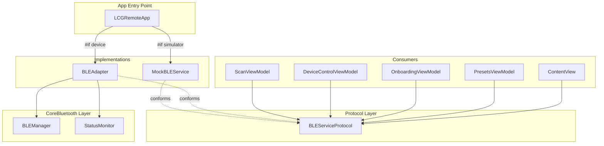

# Design Document: Real BLE Integration

## Overview

This design replaces the direct dependency on `MockBLEService` throughout the LCGRemote app with a protocol-based abstraction (`BLEServiceProtocol`). A concrete `BLEAdapter` class conforms to the protocol and wraps the existing `BLEManager` (CoreBluetooth). Views and view models depend only on the protocol, enabling seamless switching between mock (simulator) and real (device) implementations via a single `#if targetEnvironment(simulator)` toggle in the app entry point.

The key architectural change is introducing a unified device model (`BLEDevice`) that replaces `MockDevice` across all consumer code, making both `DiscoveredDevice` (from CoreBluetooth) and simulated devices representable through the same type.

## Architecture



**Design Decisions:**

1. **Single protocol, two conformers** — `BLEServiceProtocol` is the sole abstraction. No intermediate wrappers or adapter chains.
2. **BLEDevice as unified model** — A new `BLEDevice` struct replaces `MockDevice` everywhere. It holds `id`, `name`, `unitType`, `rssi`, and optionally a `CBPeripheral` reference (nil for mock devices). This avoids importing CoreBluetooth in view code.
3. **Adapter owns state mapping** — `BLEAdapter` subscribes to `BLEManager`'s publishers and translates `DiscoveredDevice`/`LCGDevice` into `BLEDevice` instances. It also maps `statusNotificationSubject` bytes into `DeviceStatus` published state.
4. **No protocol extensions with default implementations** — Each conformer provides its own complete implementation. This keeps behavior explicit and testable.

## Components and Interfaces

### BLEServiceProtocol

```swift
import Foundation
import Combine

/// Unified protocol defining all BLE operations consumed by views and view models.
@MainActor
protocol BLEServiceProtocol: ObservableObject {
    // MARK: - Published State
    var discoveredDevices: [BLEDevice] { get }
    var isScanning: Bool { get }
    var connectedDevice: BLEDevice? { get }
    var connectionState: BLEConnectionState { get }
    var deviceStatus: BLEDeviceStatus { get }
    var statusMessage: String { get }

    // MARK: - Scanning
    func startScan()
    func stopScan()

    // MARK: - Connection
    func connect(to device: BLEDevice)
    func disconnect()

    // MARK: - Commands
    func executeFloorCommand(profile: FloorProfile)
    func executeCallCommand()

    // MARK: - Preset Execution
    func executePresetSequence(
        preset: LocationPreset,
        onPhaseChange: @escaping (PresetPhase) -> Void,
        completion: @escaping (Bool) -> Void
    )
}
```

### BLEDevice (Unified Device Model)

```swift
import Foundation

/// Protocol-compatible device model used by all views and view models.
/// Replaces MockDevice as the canonical device representation.
struct BLEDevice: Identifiable, Hashable {
    let id: String
    var name: String
    let unitType: UnitType
    var rssi: Int
    var isReachable: Bool

    /// Hashing and equality based on id only (peripheral UUID string).
    func hash(into hasher: inout Hasher) {
        hasher.combine(id)
    }

    static func == (lhs: BLEDevice, rhs: BLEDevice) -> Bool {
        lhs.id == rhs.id
    }
}
```

### BLEConnectionState & BLEDeviceStatus

```swift
/// Connection lifecycle states exposed through the protocol.
enum BLEConnectionState: String {
    case disconnected
    case connecting
    case connected
}

/// Device operational status mapped from BLE notification bytes.
enum BLEDeviceStatus: String, CaseIterable {
    case idle
    case busy
    case done
    case error
}
```

### BLEAdapter

```swift
import Foundation
import Combine
import CoreBluetooth

/// Concrete adapter wrapping BLEManager for real BLE communication.
/// Conforms to BLEServiceProtocol and translates CoreBluetooth events
/// into the protocol's published state.
@MainActor
final class BLEAdapter: ObservableObject, BLEServiceProtocol {
    // Published protocol state
    @Published var discoveredDevices: [BLEDevice] = []
    @Published var isScanning: Bool = false
    @Published var connectedDevice: BLEDevice? = nil
    @Published var connectionState: BLEConnectionState = .disconnected
    @Published var deviceStatus: BLEDeviceStatus = .idle
    @Published var statusMessage: String = ""

    // Internal
    private let bleManager: BLEManager
    private var cancellables = Set<AnyCancellable>()
    private var commandTimeoutTask: Task<Void, Never>?
    private var statusResetTask: Task<Void, Never>?
    private var reconnectCount: Int = 0
    private let maxReconnectAttempts = 3
    private var isUserDisconnect = false

    init(bleManager: BLEManager = BLEManager()) {
        self.bleManager = bleManager
        setupBindings()
    }
    // ... implementation
}
```

**Key responsibilities of BLEAdapter:**

| Responsibility | Mechanism |
|---|---|
| Device discovery mapping | Subscribe to `bleManager.$discoveredDevices`, map each `DiscoveredDevice` → `BLEDevice` |
| Scan state | Forward `bleManager.$isScanning` |
| Connection management | Async call to `bleManager.connect(to:)`, update `connectionState` on success/failure |
| Disconnect | Call `bleManager.disconnect(from:)`, reset state, set `isUserDisconnect` flag |
| Command execution | Encode via `CommandEncoder`, write via `bleManager.write(data:to:)` |
| Status notifications | Subscribe to `bleManager.statusNotificationSubject`, map bytes → `BLEDeviceStatus` |
| Auto-reconnect | On unexpected disconnect, retry up to 3 times |
| Command timeout | 5-second timeout task after write; sets `.error` if no notification |
| Auto-reset | `.done` resets to `.idle` after 1s; `.error` resets after 2s |

### MockBLEService Conformance

The existing `MockBLEService` will be updated to:
1. Conform to `BLEServiceProtocol`
2. Replace `MockDevice` usage with `BLEDevice`
3. Replace its internal `ConnectionState`/`DeviceStatus` enums with the shared `BLEConnectionState`/`BLEDeviceStatus` types
4. Keep all timer-based simulation logic unchanged

### View Model Changes

All view models receive `any BLEServiceProtocol` (or a generic constraint) instead of `MockBLEService`:

```swift
final class ScanViewModel<Service: BLEServiceProtocol>: ObservableObject {
    private let bleService: Service
    init(bleService: Service) { ... }
}
```

Alternatively, since `@EnvironmentObject` requires a concrete type, we can use a type-erased wrapper or rely on the generic approach with `@StateObject` injection at the app level. The chosen approach is **generics on view models** with concrete type resolved at the app entry point.

### App Entry Point

```swift
@main
struct LCGRemoteApp: App {
    #if targetEnvironment(simulator)
    @StateObject private var bleService = MockBLEService()
    #else
    @StateObject private var bleService = BLEAdapter()
    #endif

    var body: some Scene {
        WindowGroup {
            ContentView()
                .environmentObject(bleService)
        }
    }
}
```

Since both `MockBLEService` and `BLEAdapter` are `ObservableObject`, they can be injected as `@EnvironmentObject`. Views access them through the protocol via a shared type alias or direct `@EnvironmentObject` usage with the concrete type (which is conditionally compiled only at the entry point).

## Data Models

### BLEDevice (replaces MockDevice)

| Field | Type | Description |
|---|---|---|
| `id` | `String` | Peripheral UUID string (or synthetic ID for mocks) |
| `name` | `String` | Advertised device name ("LiftGateIn-001") |
| `unitType` | `UnitType` | `.interior` or `.exterior` |
| `rssi` | `Int` | Signal strength in dBm |
| `isReachable` | `Bool` | Always `true` for real devices; mock may set `false` |

### Mapping: DiscoveredDevice → BLEDevice

```swift
extension BLEDevice {
    init(from discovered: DiscoveredDevice) {
        self.id = discovered.id.uuidString
        self.name = discovered.name
        self.unitType = discovered.unitType
        self.rssi = discovered.rssi
        self.isReachable = true
    }
}
```

### Mapping: BLEDevice → DiscoveredDevice lookup

The `BLEAdapter` maintains an internal dictionary `[String: DiscoveredDevice]` keyed by UUID string, so that when `connect(to:)` is called with a `BLEDevice`, it can resolve the underlying `CBPeripheral`.

### DeviceState → BLEDeviceStatus mapping

```swift
extension BLEDeviceStatus {
    init(from deviceState: DeviceState) {
        switch deviceState {
        case .idle: self = .idle
        case .busy: self = .busy
        case .done: self = .done
        case .error: self = .error
        }
    }
}
```

## Correctness Properties

*A property is a characteristic or behavior that should hold true across all valid executions of a system — essentially, a formal statement about what the system should do. Properties serve as the bridge between human-readable specifications and machine-verifiable correctness guarantees.*

### Property 1: Device mapping preserves identity and metadata

*For any* valid `DiscoveredDevice` with a non-empty name, any `UnitType`, and any RSSI value, mapping it to a `BLEDevice` via `BLEDevice(from:)` SHALL produce a `BLEDevice` with the same UUID string as `id`, the same `name`, the same `unitType`, and the same `rssi` value.

**Validates: Requirements 2.2**

### Property 2: Floor command encoding correctness

*For any* valid coordinate triple (x: 0–144, y: 0–208, z: 0–100), encoding via `CommandEncoder.encodeFloorCommand(x:y:z:)` SHALL produce exactly 3 `Data` values where the first byte of each equals `0x01 + coordinate`, and decoding those bytes back by subtracting `0x01` SHALL yield the original coordinates.

**Validates: Requirements 2.7**

### Property 3: Notification byte to DeviceStatus mapping

*For any* `UInt8` value, `DeviceState(fromByte:)` SHALL return `.idle` for 0, `.busy` for 1, `.done` for 2, `.error` for 3, and `.error` for any value greater than 3. Furthermore, mapping any `DeviceState` to `BLEDeviceStatus` SHALL preserve the semantic meaning (idle→idle, busy→busy, done→done, error→error).

**Validates: Requirements 2.9, 5.2, 5.3**

### Property 4: Device filtering and classification

*For any* set of peripherals with mixed service UUIDs (some interior, some exterior, some unrelated), the adapter's filtering logic SHALL include exactly those peripherals advertising the interior (`19B10001-...1217`) or exterior (`19B10001-...1214`) service UUID, and SHALL classify each as `.interior` or `.exterior` respectively with no misclassifications.

**Validates: Requirements 3.1, 3.2**

### Property 5: RSSI reflects most recent advertisement

*For any* device and any sequence of RSSI values received via duplicate advertisements, the adapter's published `rssi` for that device SHALL always equal the most recently received RSSI value.

**Validates: Requirements 3.5**

## Error Handling

| Error Condition | Response | User-Facing Message |
|---|---|---|
| Bluetooth powered off / unavailable | Set `connectionState = .disconnected` | "Bluetooth is not available" |
| Bluetooth permission denied | Block scanning, set `isScanning = false` | "Bluetooth permission denied. Enable in Settings." |
| Connection timeout (5s) | Set `connectionState = .disconnected` | "Connection timed out. Device may be out of range." |
| Connection failure | Set `connectionState = .disconnected` | "Connection failed. Device not reachable." |
| Unexpected disconnect (after retries exhausted) | Set `connectionState = .disconnected` | "Device disconnected unexpectedly." |
| Command write failure | Set `deviceStatus = .error` | "Command failed. Please retry." |
| Command notification timeout (5s) | Set `deviceStatus = .error` | "Command timed out" |
| Preset step failure | Stop sequence, `completion(false)` | Phase-specific error shown in UI |
| Invalid coordinate values | Throw `CommandError` before write | "X/Y/Z coordinate exceeds maximum" |

**Auto-recovery behaviors:**
- `deviceStatus == .done` → resets to `.idle` after 1 second
- `deviceStatus == .error` → resets to `.idle` after 2 seconds
- Unexpected disconnect → up to 3 automatic reconnection attempts
- User-initiated disconnect → no auto-reconnect

## Testing Strategy

### Unit Tests (Example-Based)

- **Connection state machine**: Verify `.disconnected` → `.connecting` → `.connected` transitions
- **Disconnect resets state**: Verify all published properties return to defaults
- **Auto-reconnect policy**: Verify 3 attempts on unexpected disconnect, 0 on user disconnect
- **Command timeout**: Verify 5-second timeout triggers `.error` status
- **Auto-reset timing**: Verify `.done` → `.idle` after 1s, `.error` → `.idle` after 2s
- **Preset sequence ordering**: Verify phases execute in correct order
- **Preset failure halts execution**: Verify `completion(false)` and no subsequent steps
- **Bluetooth unavailable handling**: Verify appropriate state and message
- **Permission denied handling**: Verify scan is blocked with correct message

### Property-Based Tests (PBT)

Property-based tests use the `swift-testing` framework with a custom property testing helper or `SwiftCheck` library. Each test runs a minimum of **100 iterations** with randomly generated inputs.

| Property | Test Description | Tag |
|---|---|---|
| 1 | Generate random DiscoveredDevice values, map to BLEDevice, assert field equality | Feature: real-ble-integration, Property 1: Device mapping preserves identity and metadata |
| 2 | Generate random valid (x, y, z) triples, encode, decode, assert round-trip | Feature: real-ble-integration, Property 2: Floor command encoding correctness |
| 3 | Generate random UInt8 values, map through DeviceState and BLEDeviceStatus, assert correct mapping | Feature: real-ble-integration, Property 3: Notification byte to DeviceStatus mapping |
| 4 | Generate random peripheral sets with mixed UUIDs, filter, assert only LCG UUIDs survive with correct classification | Feature: real-ble-integration, Property 4: Device filtering and classification |
| 5 | Generate random RSSI update sequences, apply in order, assert final published value equals last | Feature: real-ble-integration, Property 5: RSSI reflects most recent advertisement |

### Integration Tests

- **Real BLE scan on device**: Verify `startScan()` activates CoreBluetooth scanning (requires hardware)
- **Preset end-to-end**: Verify full exterior→interior sequence with mock BLEManager
- **Onboarding flow**: Verify permission prompt → scan → device selection → connection

### Build Verification

- **Simulator build compiles**: No CoreBluetooth references in views/view models
- **Device build compiles**: BLEAdapter correctly wraps BLEManager
- **No MockBLEService references in consumer code**: Grep verification
